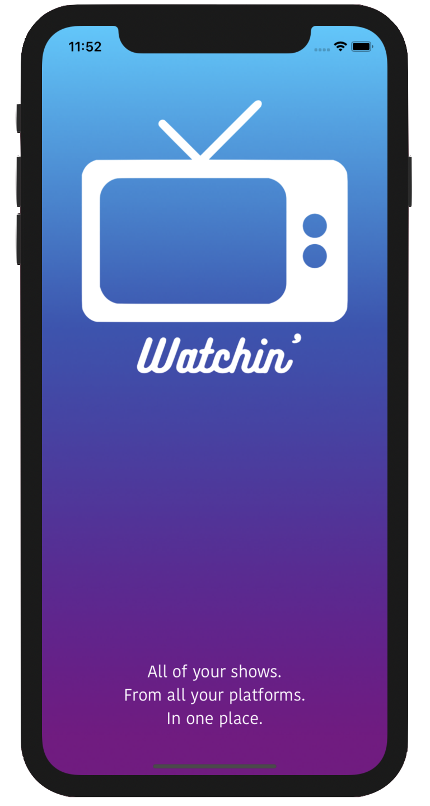
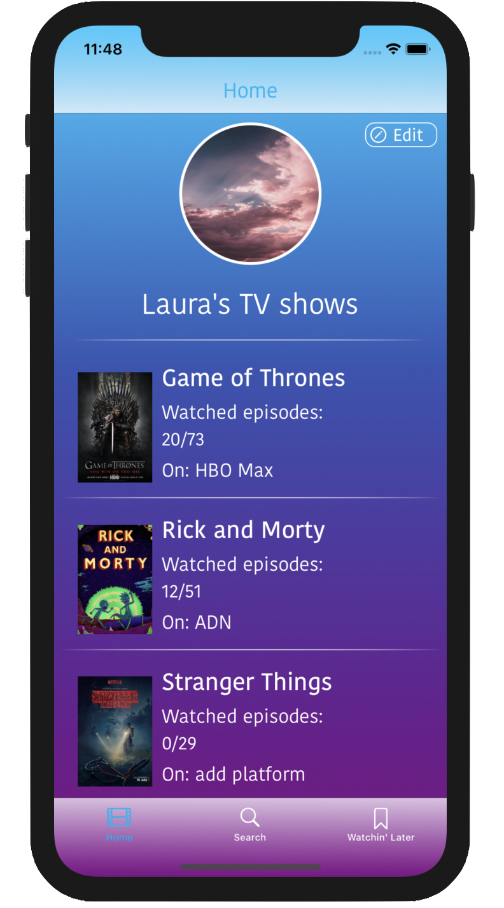
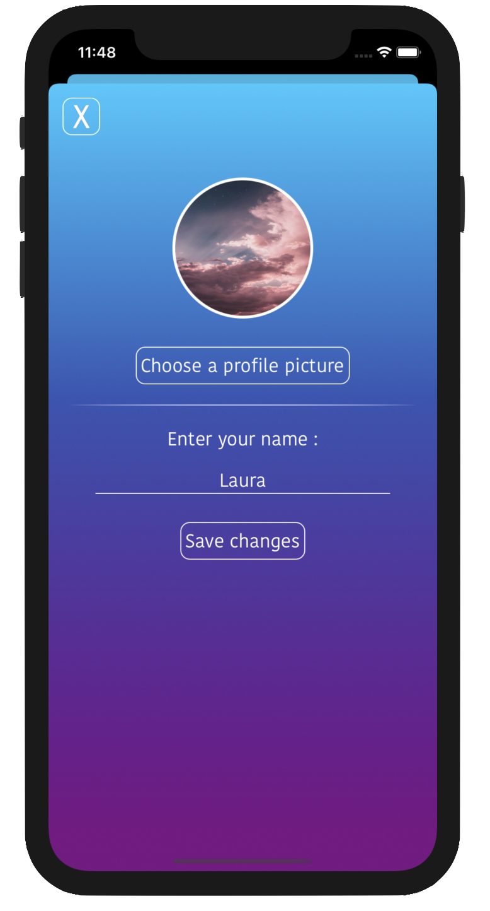
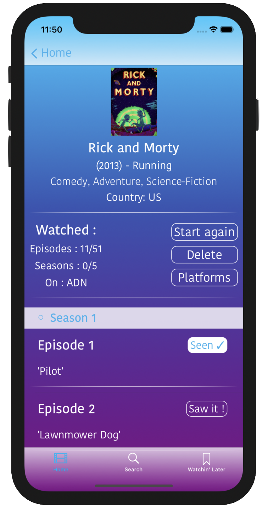
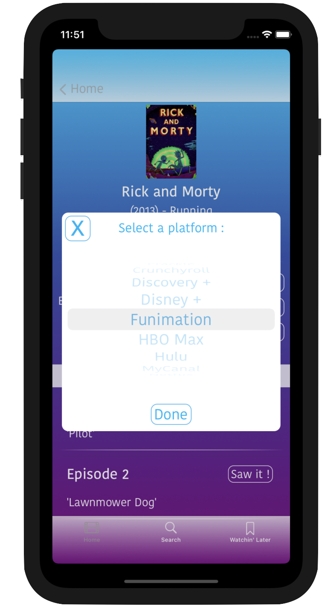
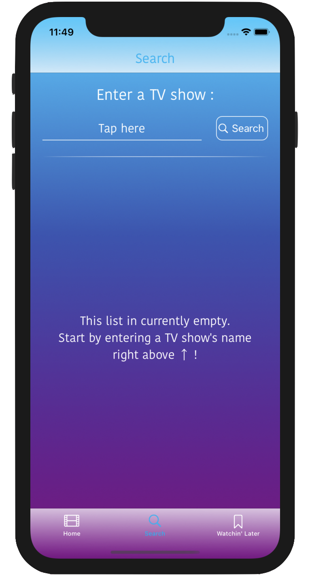
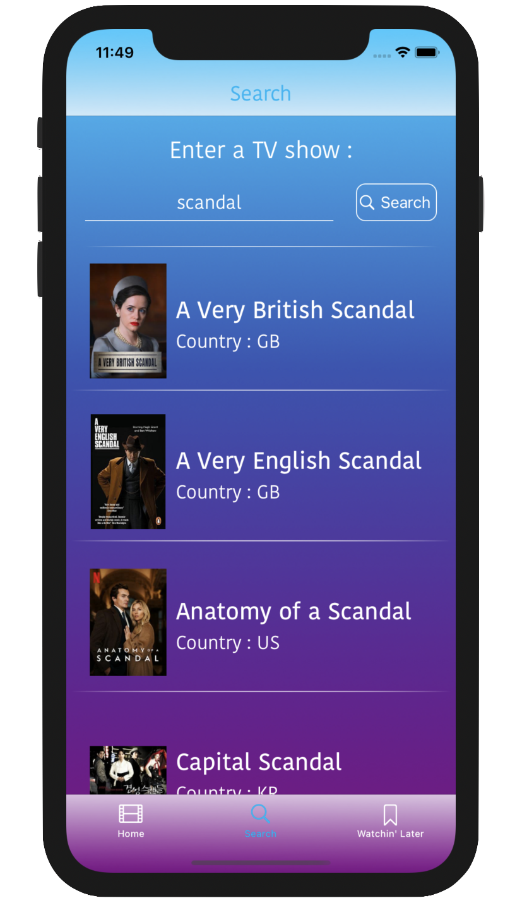
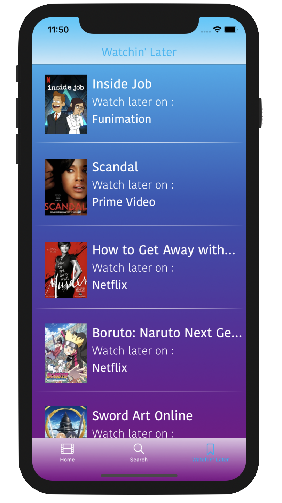
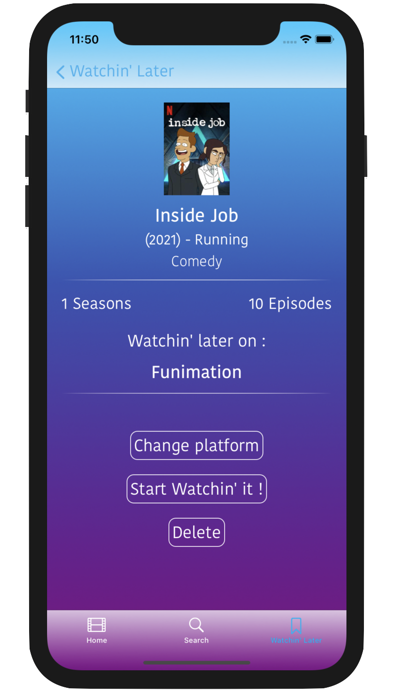

# Watchin'

**Watchin'** is an iOS app to keep track of all your tv shows - across all of your streaming platforms.
You can search for new tv shows to watch, save the shows you are currently watchin, keep track of your progression in their seasons and episodes, and save shows to watch later.

 

## Version

Current version : V1.
Supports iOS 14+. 
Available in portrait mode.
**Unit tests : ✓**

## API

The **Episodate** Tv Shows API is used in this app to search tv shows and their informations.
[More about it](https://www.episodate.com/api)

## Pods
Pods used in this project are [Alamofire](https://cocoapods.org/pods/alamofire) to manage network calls and JSON decoding, and [AlamofireImage](https://cocoapods.org/pods/alamofireimage) to manage images easily.

## Data persistence
[CoreData](https://developer.apple.com/documentation/coredata) is used to manage and save data.

# Functionnalities
- [x] See and update profile picture and name

- [x] See all currently watched shows

- [x] Track watched episodes and seasons of shows

- [x] Store and update the current streaming platform used for each show

- [x] Search shows by title

- [x] Learn more about shows

- [x] Add shows to currently watched shows

- [x] Add shows to a wishlist to watch them later

- [x] Manage lists of currently watched shows and shows to watch later

## Home

First tab of the app, where you can access the profile editing page, and see all of your currently watched shows.

 

By clicking on a show, you can access its tracking screen, and there, mark its episodes as **Seen** by a tap on the "**Saw it !**" button, choose/update your streaming platform by a tap on "**Platforms**", start the show again from the beginning by a tap on "**Start again**" and delete the show from your currently watched shows by a tap on "**Delete**"

## Search

Second tab of the app, where you can search a show by its title.

 

By clicking on a result, you can access the detail page of chooses show, and see all of its infos : number of seasons, status, genres, start date, country, and a description. You can also learn more about it by clicking on "**See more**".

From here, you can either **Add it to your shows** to start tracking it or **Add it to Watchin' Later** to save it for later.

## Watchin' Later

Last but not least, the third tab of the app.
Here, you can see all your saved for later show, and on which platform to see them.

By clicking on a show, you can either modify which platform you wish to watch it on by a tap on "**Change platform**", move it to your list of currently watched shows and start tracking it by a tap on "**Start Watchin' it !**" or simply delete it for your wishlist by a tap on "**Delete**".

>*Currently in developpment.*
